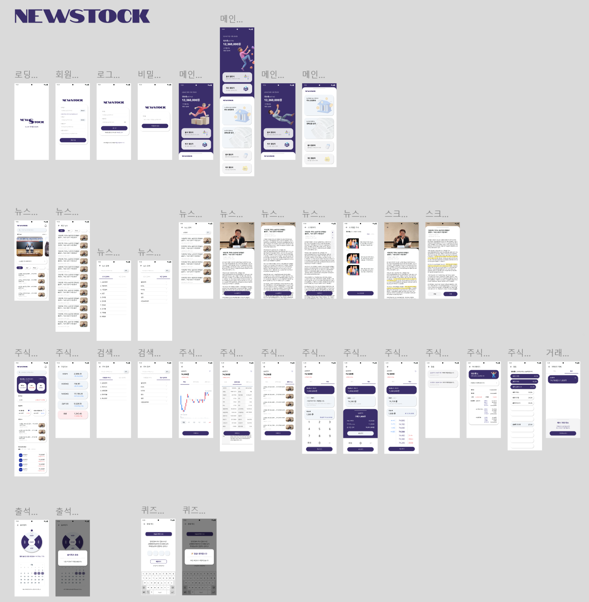
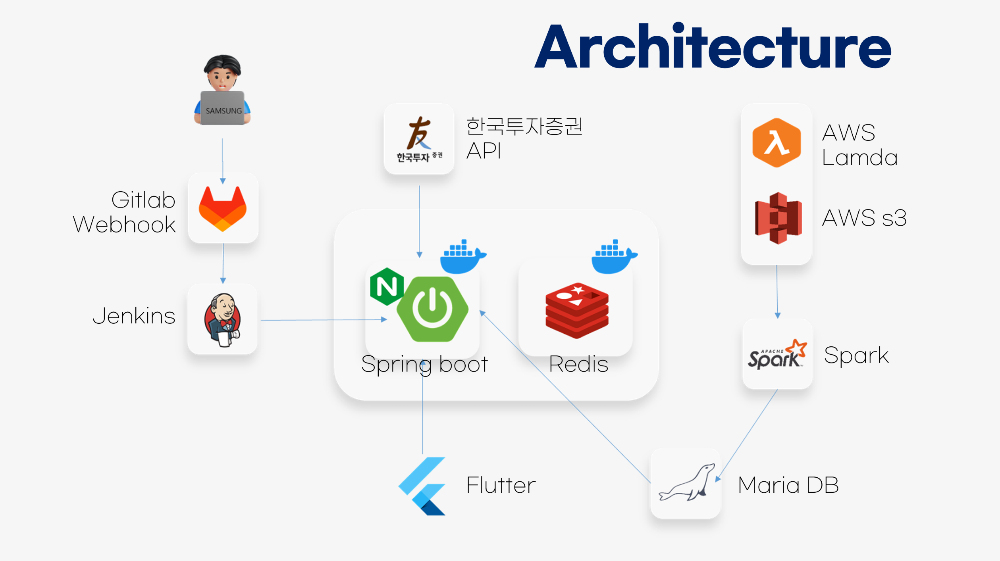
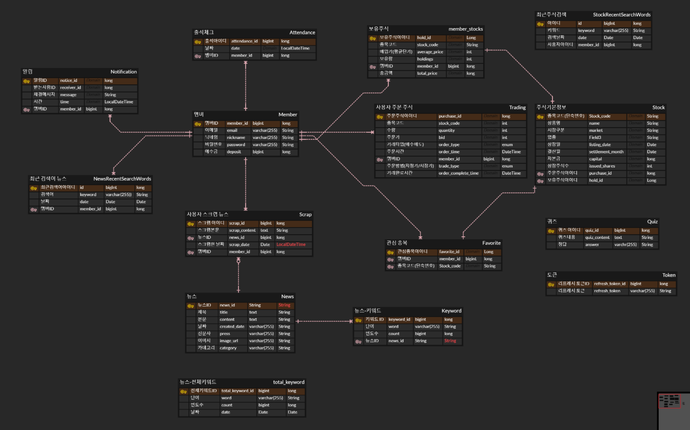
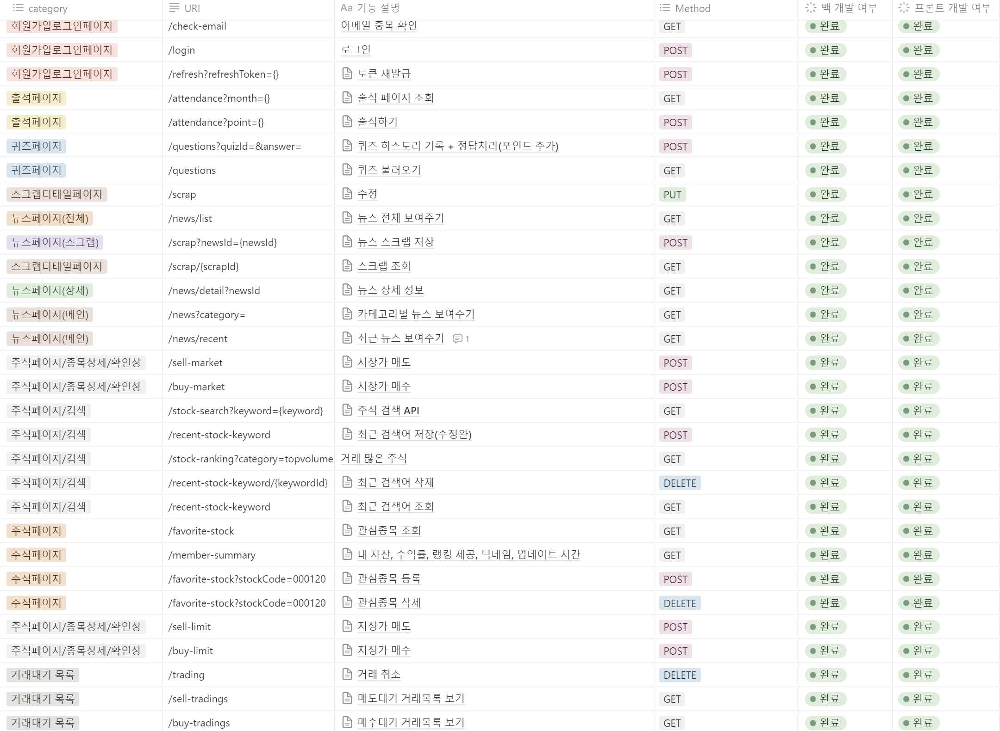

# 📈 newStock 📉
**뉴스**와 **모의투자**를 통한 경제 교육 앱

## 📅 프로젝트 소개
**삼성 청년 SW 아카데미 11th 특화프로젝트 우수상**🏆

###  프로젝트 개발 기간
2024.08.26 ~ 2024.10.11 (7주)

###   기획 배경
- **경제 문맹**이라는 신조어도 생길만큼 문제 심각
- 대한민국 국민 경제 이해력 평균 56.3점, **금융 문맹률 67%**
- 주식 시장과 경제 뉴스의 관계를 쉽게 학습할 수 있는 도구의 필요성 증가
###  목표
- 사용자들이 경제 흐름을 파악하고 투자 의사 결정을 연습하며, 금융 지식을 자연스럽게 쌓을 수 있도록 지원
- 주식 시장과 경제 뉴스의 관계를 쉽게 학습할 수 있는 도구 제공
- 경제 문맹을 줄이기 위해, 실시간 경제 뉴스를 활용한 **모의 주식 투자 학습 플랫폼** 제공

## 🚀 기능 소개
### 주식 페이지
  </br>
  </br>
- 실제 주식 시장 데이터를 기반으로 한 모의 투자 기능
- **우선순위 큐** 및 스케줄링을 통한 투자 관리 기능

### 뉴스 페이지
 </br>
- 최신 경제 뉴스를 실시간으로 제공
- **Spark**를 활용한 뉴스 본문 경제 단어 추출 텍스트 마이닝 분산처리(1master, 2worker)
- **Querydsl**을 사용하여 빠른 검색 지원
- 뉴스 스크랩 기능

### 퀴즈 페이지
 </br>
- 금융용어 700선과 한국 상장 주식 회사 관련 퀴즈 제공
- 금융 지식과 경제 이해도 향상에 기여

### 출석 페이지
 </br>
- 출석 체크 및 사용자 참여도 향상 기능

### 회원 가입 및 로그인
   
## 💚 기대 효과
- 경제 교육 강화
- 투자 스킬 향상
- 경제 이해도 증진
- 투자 관심 유도 및 활성화

## 🏗️ 설계
###  와이어 프레임
</br>

###  시스템 아키텍쳐
</br>

### ERD
</br>

###  API 명세서
</br>

## 🛠️ 기술 스택

**FE Development**

   

**BE Development**

     

**Database**

     


**Data Distributed Processing**

     


**Infra**

   

**CI/CD**

  

**SUPPORT TOOL**

          


## 👥 팀원 소개
<table>
<tr>
    <td align="center"><a href="https://github.com/boeunyoon"><b>👑윤보은</b></a></td>
    <td align="center"><a href="https://github.com/Do1K"><b>강도원</b></a></td>
    <td align="center"><a href="https://github.com/kimsw0516"><b>김성원</b></a></td>
    <td align="center"><a href="https://github.com/zhzzang"><b>이주희</b></a></td>
    <td align="center"><a href="https://github.com/aswe0409"><b>정석영</b></a></td>
    <td align="center"><a href="https://github.com/stopvvon"><b>정지원</b></a></td>
  </tr>
 <tr>
    <td align="center"><a href="https://github.com/boeunyoon"></a></td>
       <td align="center"><a href="https://github.com/Do1K"></a></td>
    <td align="center"><a href="https://github.com/kimsw0516"></a></td>
    <td align="center"><a href="https://github.com/zhzzang"></a></td>
    <td align="center"><a href="https://github.com/aswe0409"></a></td>
    <td align="center"><a href="https://github.com/stopvvon"></a></td>

  </tr>
  <tr>
    <td align="center"><b>FE & BE</b></a></td>
    <td align="center"><b>BE & INFRA</b></a></td>
    <td align="center"><b>FE</b></a></td>
    <td align="center"><b>BE</b></a></td>
    <td align="center"><b>DATA & BE</b></a></td>
    <td align="center"><b>FE</b></a></td>
  </tr>
</table>

</br>
</br>

# 🔥 나의 기여


# 1️⃣ 실시간 주식 체결 데이터를 활용한 비동기 모의 거래 시스템

> 💡 개요
> 
> 
> 한국투자증권 API에서 제공하는 실시간 주식 체결 데이터(WebSocket)를 기반으로, 사용자의 **지정가 주문을 비동기적으로 처리**하는 모의 거래 시스템입니다. 사용자의 요청에 즉각적으로 응답하면서도, 백그라운드에서는 수많은 거래를 안정적으로 처리하는 것을 목표로 설계했습니다.
> 

<br/>

## 🎯 핵심 설계 목표 및 고려사항

### 1. 비동기/논블로킹 처리를 통한 사용자 경험 극대화

사용자가 지정가 주문을 요청했을 때, 실제 체결이 이루어질 때까지 기다리게 할 수는 없습니다. `CompletableFuture.runAsync`를 적극적으로 활용하여 주문 접수와 실제 체결 로직을 분리했습니다. 이를 통해 사용자는 **주문 요청 즉시 '접수 완료' 응답**을 받을 수 있으며, 시스템은 백그라운드에서 효율적으로 거래를 처리하는 **비동기-논블로킹 모델**을 구현했습니다.

### 2. 동시성 제어를 통한 데이터 정합성 확보

여러 사용자의 주문이 하나의 종목에 몰릴 경우, 여러 스레드가 공유 자원(주문 대기열)에 동시에 접근하여 **레이스 컨디션(Race Condition)**이 발생할 수 있습니다. `synchronized` 키워드를 사용해 **임계 영역(Critical Section)**을 설정함으로써, '주문 확인 후 처리' 로직이 원자적(Atomic)으로 실행되도록 보장하여 데이터 정합성을 확보했습니다.

### 3. 상태 분리를 통한 효율적인 실시간 처리

주문 취소 요청이 왔을 때, 매번 DB에 취소 여부를 조회하는 것은 실시간 처리 루프에 큰 부담을 줍니다. **DB의 상태**와 **메모리의 실시간 상태 플래그**(`Set<Long>`)를 이원화하여, 백그라운드 처리 중에는 메모리에서 매우 빠른 속도로 취소 여부를 확인하고, 최종 처리 시점에만 DB 상태를 다시 확인하여 일관성을 맞추는 영리한 방식을 채택했습니다.

---

## 📉 시장가 주문 체결 흐름

가장 간단한 흐름입니다. 사용자가 '시장가'로 주문하면, 시스템은 현재 가격으로 즉시 거래를 체결시킵니다.

1. **요청 접수 (`TradingService`)**: 컨트롤러가 `sellByMarket` 또는 `buyByMarket` 메서드를 호출합니다.
2. **현재가 조회**: `kisService`를 통해 해당 종목의 현재 시장가를 즉시 조회합니다.
3. **거래 완료 처리**: 조회된 시장가로 거래를 바로 완료 처리하고, `Trading` 엔티티에 완료 시간을 기록합니다.
4. **자산 변경**: `MemberStocksService`와 `MemberService`를 호출하여 사용자의 주식 보유량과 예수금을 즉시 변경합니다.
5. **DB 저장 및 알림**: 완료된 거래 정보를 데이터베이스에 저장하고, 사용자에게 알림을 보낸 뒤 흐름이 종료됩니다.

> ▶️ 관련 코드 보기 (TradingService.java)
> 

```java
@Transactional
    public TradeResponse sellByMarket(Member member, TradeRequest sellRequest) {

        sellPossible(member, sellRequest);
        Trading trading = sellRequest.toEntity(member, OrderType.SELL, TradeType.MARKET);
        // 1. 현재가 조회
        trading.confirmBid(getStockPrPr(sellRequest.getStockCode()));
        // 2. 즉시 완료 처리
        trading.tradeComplete(LocalDateTime.now());
        // 3. 사용자 자산 변경
        memberStocksService.sellComplete(member.getId(),sellRequest.getStockCode(),sellRequest.getQuantity(),trading.getBid());
        memberService.updateDeposit(member.getId(),(long)(trading.getBid() * trading.getQuantity()),OrderType.SELL);
        // 4. DB 저장
        tradingRepository.save(trading);

        CompletableFuture<Void> future=sendTradeMessage(member.getId(),sellRequest.getStockCode(), (long) sellRequest.getQuantity(),OrderType.SELL,trading.getBid());

        return new TradeResponse(OrderType.SELL, trading.getBid(), trading.getOrderCompleteTime(), trading.getQuantity(), trading.getBid() * trading.getQuantity());
    }
```

## 📈 지정가 주문 체결 흐름

지정가 주문은 **[접수] → [대기] → [실시간 매칭] → [최종 처리]**의 4단계 비동기 파이프라인을 통해 처리됩니다.

`사용자` → `TradingService (주문 접수)` → `TradeQueue (주문 대기)` → `KisServiceSocket (실시간 매칭)` → `TradingService (최종 처리)`

### 1단계: 주문 접수 및 비동기 처리 시작

`TradingService`는 사용자의 지정가 주문을 받아 DB에 '미체결' 상태로 기록하고, 메모리에 있는 `TradeQueue`에 주문을 추가합니다. 이후 `CompletableFuture`를 통해 KIS 서버에 해당 종목의 실시간 데이터 수신을 요청하는 작업을 백그라운드 스레드로 위임하고, 즉시 사용자에게 응답합니다.

> ▶️ 관련 코드 보기 (TradingService.java)
> 

```java
@Transactional
public void buyByLimit(Member member, TradeRequest buyRequest) throws JsonProcessingException {
    if(!buyPossible(member,buyRequest)){
        throw new IllegalArgumentException("Buy not possible(Insufficient account balance)");
    }
    // 1. '미체결' 상태의 거래를 DB에 기록
		Trading trading = buyRequest.toEntity(member, OrderType.BUY, TradeType.LIMIT);
		tradingRepository.save(trading);
		memberService.updateDeposit(member.getId(), (long) trading.getBid() * trading.getQuantity(), OrderType.BUY);
		
		
		// 2. 메모리 대기열(Queue)에 주문 추가
		TradeItem tradeItem = new TradeItem(member, trading.getBid(), trading.getQuantity(), remain, trading.getOrderTime(), trading);
		tradeQueue.addBuy(buyRequest.getStockCode(), tradeItem);
		
		
		// 3. 실시간 데이터 구독 요청을 백그라운드 스레드에 위임
		processWebSocket(buyRequest.getStockCode());
		
}
		 
		
private CompletableFuture processWebSocket(String stockCode) {
			return CompletableFuture.runAsync(() -> {
			kisServiceSocket.sendMessage(stockCode, "1");
	});
}
		
```

> 
> 

### 2단계: 동시성을 고려한 거래 체결

`KisServiceSocket`은 실시간 체결 데이터를 수신하면, `TradeQueue`에서 대기 중인 주문과 가격을 비교합니다. 이때, 여러 스레드가 동시에 큐에 접근하는 것을 막기 위해 **큐를 조작하는 핵심 로직만 `synchronized` 블록으로 감싸** 잠금을 최소화하고 처리 효율을 높였습니다.

> ▶️ 관련 코드 보기 (KisServiceSocket.java의 sellTrade 메서드)
> 

```java
private void sellTrade(SocketItem socketItem, String stockCode, Queue<TradeItem> sellItems){
        TradeItem complete = null;
				
				// 큐를 직접 조작하는 부분만 잠근다 (Lock 최소화)
        synchronized (sellItems) {
            if (sellItems.isEmpty()) return;

            while (!sellItems.isEmpty() && tradingHandleService.isCanceled(sellItems.peek().getTrading().getId())) {
                TradeItem removed = sellItems.poll();
                tradingHandleService.cancelComplete(removed.getTrading().getId());
                log.info("<{}> [{}]님 매수거래취소", stockCode, removed.getMember().getNickname());
            }

            if (sellItems.isEmpty()) return;

            if (socketItem.getPrice() >= sellItems.peek().getBid()) {
                if (socketItem.getPrice() == sellItems.peek().getBid()) {
                    sellItems.peek().trade(socketItem.getMount());
                } else {
                    sellItems.peek().complete();
                }

                if (sellItems.peek().getRemaining() > 0) return;
								// 큐에서 아이템을 빼내는 것까지만 synchronized 블록 안에서 수행
                complete = sellItems.poll();
            }
        }// ✨ 여기서 잠금이 풀린다!

				// 시간이 오래 걸리는 DB 작업 등은 잠금이 풀린 후에 수행
        if (complete != null) {
            sellComplete(stockCode, complete);
            log.info("<{}> [{}]님 매도거래완료", stockCode, complete.getMember().getNickname());
        }
    }
```

> 
> 

### 3단계: 최종 처리 및 상태 업데이트

거래가 체결되면, **별도의 `TradingService` Bean**에 구현된 `@Transactional` 메서드를 호출하여 최종 처리를 위임합니다. 이는 Spring AOP 프록시가 정상적으로 동작하도록 하여 트랜잭션의 원자성을 보장하기 위함입니다. 이 메서드 안에서 **'이미 취소된 거래인지'** 다시 한번 확인하는 방어 로직을 추가하여 레이스 컨디션을 차단했습니다.

> ▶️ 관련 코드 보기 (TradingService.java의 finalizeSellTrade 메서드)
> 

```java
@Transactional
    public void finalizeSellTrade(TradeItem complete, String stockCode) {
        Trading trading = tradingRepository.findById(complete.getTrading().getId())
                .orElseThrow(() -> new IllegalArgumentException("거래를 찾을 수 없습니다."));

				// 최종 커밋 직전, DB에서 직접 상태를 확인하여 레이스 컨디션 방지
        if (trading.isCanceled()) {
            log.warn("이미 취소된 거래(ID: {})에 대한 체결 시도가 감지되어 중단합니다.", trading.getId());
            return;
        }
				
				// DB를 변경하는 모든 로직을 하나의 트랜잭션으로 묶음
        memberStocksService.sellComplete(complete.getMember().getId(),stockCode,complete.getQuantity(),complete.getBid());
        memberService.updateDeposit(complete.getMember().getId(), (long) (complete.getQuantity()*complete.getBid()), OrderType.SELL);
        trading.tradeComplete(LocalDateTime.now());
        notificationService.send(complete.getMember().getId(),stockCode, (long) complete.getQuantity(),OrderType.SELL,complete.getBid());
    }
```

---

## 🗑️ 주문 취소 흐름

주문 취소는 '**즉각적인 DB 상태 변경**'과 '**메모리 플래그를 통한 빠른 확인**'이라는 이원화된 전략을 사용합니다.

### 1단계: 즉각적인 취소 처리 및 상태 플래그 설정

사용자가 취소를 요청하면 `TradingHandleService`는 즉시 DB의 거래 상태를 `canceled=true`로 변경하고, 동시에 메모리에 있는 `canceledTrading` Set에 해당 거래 ID를 추가합니다.

> ▶️ 관련 코드 보기 (TradingHandleService.java)
> 

```java
private final Set<Long> canceledTrading= Collections.synchronizedSet(new HashSet<>());
```

```java
@Transactional
    public void removeTrading(Long tradingId, Long memberId) {
		    
		    // 1. 메모리의 Set에 취소 플래그 추가
        canceledTrading.add(tradingId);
        
        // 2. DB의 거래 상태를 즉시 '취소'로 변경하고 환불 처리
        Trading trading=tradingRepository.findById(tradingId).get();
        if(!trading.getMember().getId().equals(memberId)){
            throw new AuthenticationCredentialsNotFoundException("권한이 없습니다.");
        }
        if(trading.getOrderType().equals(OrderType.BUY)){
            memberService.updateDeposit(memberId, (long) trading.getBid(),OrderType.SELL);
        }
        trading.cancelTrading();
        tradingRepository.save(trading);

    }
```

### 2단계: 백그라운드에서의 취소 확인 및 정리

`KisServiceSocket`의 거래 처리 루프는 DB에 매번 접근하는 대신, 메모리의 `canceledTrading` Set을 통해 매우 빠르게 취소 여부를 확인하고 해당 주문을 대기열에서 제거합니다.

> ▶️ 관련 코드 보기 (KisServiceSocket.java의 sellTrade 메서드 일부)
> 
> 
> ```java
> synchronized (sellItems) {
>     // ...
>     // 메모리 Set을 통해 매우 빠른 속도로 취소 여부 확인
>     while (!sellItems.isEmpty() && tradingHandleService.isCanceled(sellItems.peek().getTrading().getId())) {
>         TradeItem removed = sellItems.poll();
>         tradingHandleService.cancelComplete(removed.getTrading().getId());
>         log.info("<{}> [{}]님 매수거래취소", stockCode, removed.getMember().getNickname());
>     }
>     // ...
> }
> ```
> 

---

## 💡 회고 및 개선 방향

- **배운 점**: 이번 프로젝트를 통해 Spring의 `@Transactional` 동작 원리(AOP 프록시)와 `synchronized`를 이용한 정교한 동시성 제어, 그리고 `CompletableFuture`를 활용한 비동기-논블로킹 설계의 중요성을 깊이 이해할 수 있었습니다.
- **개선 방향**: 현재 아키텍처는 단일 서버 환경을 가정하고 있습니다. 서버를 2대 이상으로 확장(Scale-out)할 경우, 메모리에 저장되는 `TradeQueue`와 `canceledTrading` Set의 상태 불일치 문제가 발생합니다. 이를 해결하기 위해 **Redis의 Sorted Set**을 중앙 데이터 저장소로 도입하여 모든 서버가 상태를 공유하는 방식으로 아키텍처를 개선할 수 있습니다.

# 2️⃣ Redis Sorted Set을 활용한 실시간 주식 수익률 랭킹 시스템

> 💡  개요
> 
> 
> 실시간으로 변동하는 주식 시세를 반영하여, 모든 사용자의 수익률(ROI) 순위를 집계하는 랭킹 시스템입니다. **Redis의 Sorted Set**을 핵심 데이터 구조로 사용하여 대규모 사용자 환경에서도 **빠른 응답 속도를 보장**하도록 설계했으며, **주기적인 스케줄링**과 **API 호출 최적화**를 통해 효율적으로 최신 랭킹을 유지합니다.
> 

<br/>

## 🎯 시스템 아키텍처 및 핵심 설계

본 랭킹 시스템은 **`Application Server`** - **`Redis`** - **`External API`** 3-Tier 구조로 동작합니다. 사용자의 랭킹 조회 요청은 DB 부하 없이 Redis에서 즉시 처리되며, 무거운 랭킹 연산은 스케줄러를 통해 백그라운드에서 주기적으로 수행됩니다.

- **Redis 활용**: 랭킹 데이터의 저장 및 조회를 위해 In-Memory 저장소인 Redis를 채택했습니다. 특히 순위 집계에 최적화된 **Sorted Set(ZSET)** 자료구조를 사용하여 복잡한 랭킹 로직을 효율적으로 구현했습니다.
- **API 호출 최적화**: 랭킹 집계 시 수천 번 발생할 수 있는 외부 API 호출을, 필요한 모든 주식 정보를 **미리 수집(Batch)하고 캐싱(Caching)**하여 단 몇십 번의 호출로 최소화했습니다.
- **정교한 동점자 처리**: 수익률이 소수점까지 동일한 경우, 같은 등수를 부여하는 **'표준 경쟁 순위(Standard Competition Ranking)'** 로직을 구현하여 랭킹의 정확성을 높였습니다.

---

## 📈 랭킹 집계 흐름 (Scheduled Task)

랭킹 집계는 `@Scheduled`에 의해 장중에 주기적으로 실행되며, **[1단계: API 호출 최적화 및 ROI 계산]** -> **[2단계: 동점자 처리 및 순위 부여]** 의 2단계 파이프라인으로 구성됩니다.

### 1단계: API 호출 최적화 및 ROI 계산 (`makeRank`)

가장 큰 성능 병목이었던 외부 API 호출을 최소화하는 데 집중했습니다. 모든 회원이 보유한 주식 목록을 먼저 취합하여, 필요한 현재가 정보를 **단 한번의 루프**로 조회 및 캐싱한 후, 이를 바탕으로 모든 회원의 수익률을 빠르게 계산합니다.

> ▶️ 기존 코드
> 

```java
public void makeRank(){
        ...
        for(Member member:members){
            if(memberStocksService.getMemberStocks(member.getId()).isEmpty())continue;
            double ROI=memberROI(member.getId());
            redisService.addMemberRank(member.getId(),ROI);
        }
        ...
    }
        
        
private double memberROI(Long memberId){
        ...
        for(MemberStock memberStock:memberStocks){
            String stockCode=memberStock.getStockCode();
            int currentPrice=Integer.parseInt(kisService.getCurrentStockPrice(stockCode));
            newPrice+=currentPrice*memberStock.getHoldings();
            oldPrice+=memberStock.getAveragePrice()*memberStock.getHoldings();
        }
				...
    }
```

> ▶️ 개선된 코드 (RankService.java)
> 

```java
public void makeRank(){
        List<Member> members=memberService.findAllMember();
        redisTemplateRank.delete("memberRank");

        // 1. 필요한 모든 주식 코드를 수집 (중복 제거)
        Set<String> allStockCodes = members.stream()
                .flatMap(member -> memberStocksService.findByMember_Id(member.getId()).stream())
                .map(MemberStock::getStockCode)
                .collect(Collectors.toSet());

        // 2. 각 주식의 현재가를 한번씩만 조회하여 캐싱
        Map<String, Integer> currentPriceCache = new HashMap<>();
        for (String stockCode : allStockCodes) {
            try {
                currentPriceCache.put(stockCode, Integer.parseInt(kisService.getCurrentStockPrice(stockCode)));
            } catch (NumberFormatException e) {
                currentPriceCache.put(stockCode, 0);
            }
        }
				
				//3. 캐싱된 데이터를 사용하여 각 멤버의  ROI를 계산
        for(Member member:members){
            if(memberStocksService.getMemberStocks(member.getId()).isEmpty())continue;
            double ROI=memberROI(member.getId(),currentPriceCache);
            redisService.addMemberRank(member.getId(),ROI);
        }
        redisService.setRankTime();
    }
```

### 2단계: 동점자 처리 및 순위 부여 (`dealSameScore`)

1단계에서 계산된 수익률(Score)을 기반으로, 동일한 점수를 가진 사용자들에게 같은 등수를 부여합니다. `Map<Double, Integer>`를 사용하여 각 점수별 인원수를 카운트하고, 누적 인원을 바탕으로 실제 등수를 계산하여 별도의 Sorted Set(`memberScore`)에 저장합니다.

> ▶️ 관련 코드 보기 (RankService.java)
> 

```java
public void dealSameScore(){
        redisTemplateRank.delete("memberScore");
        // 1. `memberRank`에서 모든 멤버의 수익률 점수를 가져옴
        Map<Long,Double> ranks=redisService.getAllMembersWithScores();
        // 2. 각 수익률 점수별로 몇 명의 멤버가 있는지 카운트
        Map<Double,Integer> scores=new LinkedHashMap<>();
        for(Map.Entry<Long,Double> entry:ranks.entrySet()){
            scores.put(entry.getValue(),scores.getOrDefault(entry.getValue(),0) + 1);
        }
        // 3. 누적 인원을 기반으로 실제 등수를 계산
        int start=1;
        for(Map.Entry<Double,Integer> entry:scores.entrySet()){
            redisService.addMemberScore(entry.getKey(),start);
            start+=entry.getValue();
        }
    }
```

---

## 📊 랭킹 조회 흐름 (API Endpoint)

사용자가 랭킹 조회를 요청하면, `allRank` 메서드가 실행됩니다. 이 메서드는 DB 접근 없이 **오직 Redis에 미리 계산된 두 개의 Sorted Set 데이터만을 조합**하여 최종 응답을 생성하므로 매우 빠른 응답 속도를 보장합니다.

1. **`memberRank` ZSET 조회**: `(memberId: ROI)` 맵을 가져옵니다.
2. **`memberScore` ZSET 조회**: `(ROI: rank)` 맵을 가져옵니다.
3. 두 맵을 조합하여 각 `memberId`에 해당하는 `rank`와 `ROI`, 그리고 `nickname` 정보를 합쳐 최종 응답 데이터를 생성합니다.

> ▶️ 관련 코드 보기 (RankService.java)
> 

```java
public RankResponse allRank(){
				// 1. Redis에서 멤버별 수익률 점수 조회
        Map<Long,Double> ranks=redisService.getAllMembersWithScores();
        // 2. Redis에서 수익률 점수별 등수 조회
        Map<Double,Integer> scores=redisService.getAllRoiWithScores();
        Map<String,Double> result=new LinkedHashMap<>();
        for (Map.Entry<Long, Double> entry : ranks.entrySet()) {
            Long memberId = entry.getKey();
            Double score = entry.getValue();
            Integer memberScore=scores.get(score);

            String memberNickname=memberService.findById(memberId).getNickname();
            String key=memberScore+":"+memberNickname;
            result.put(key,score);
        }

        return new RankResponse(redisService.getRankTime(), result);
    }
```

---

## 💡 회고 및 개선 방향

- **배운 점**: 대용량 데이터의 순위를 실시간으로 처리하는 문제에서 왜 Redis Sorted Set이 강력한 도구인지 체감할 수 있었습니다. 또한, 무심코 작성한 루프 내의 API 호출이 얼마나 큰 성능 저하를 일으키는지, 그리고 이를 어떻게 최적화할 수 있는지에 대한 중요한 경험을 얻었습니다.
- **개선 방향**:
    - **데이터 정합성 강화**: 현재 랭킹 업데이트는 `makeRank`와 `dealSameScore` 두 단계로 나뉘어 있어, 그 사이에 조회 요청이 들어올 경우 불완전한 데이터가 노출될 수 있습니다. Redis의 `RENAME` 명령어를 활용하여 **임시 키에서 모든 계산을 완료한 뒤, 한 번에 실제 키로 원자적으로(Atomically) 전환**하는 방식으로 개선하여 데이터 정합성을 100% 보장할 수 있습니다.
