## 프론트엔드 진행사항

### 기술스택
- FLUTTER
- DART
- PROVIDER
- GIT
- JIRA

### 피그마
 
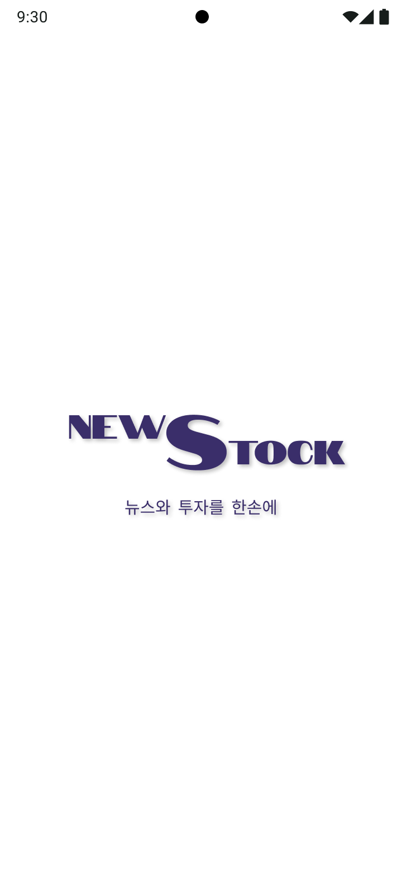
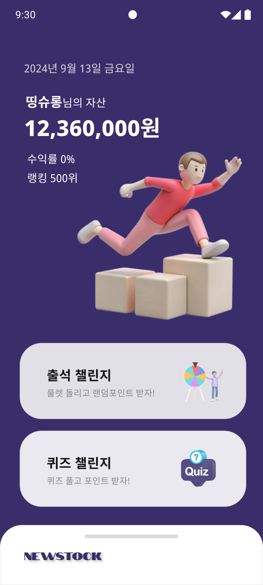

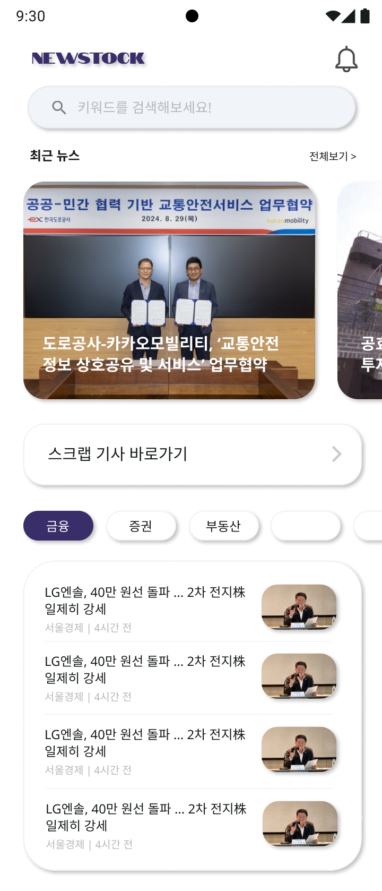
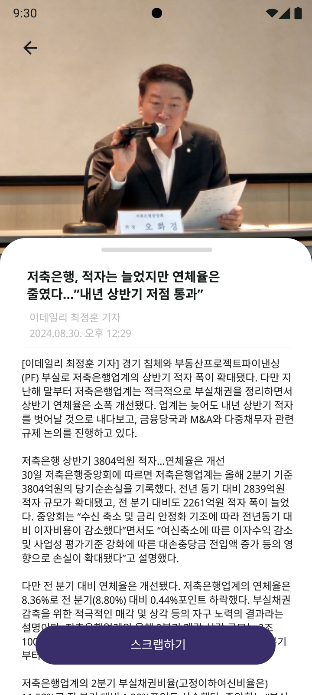
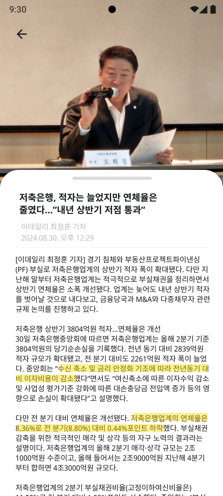
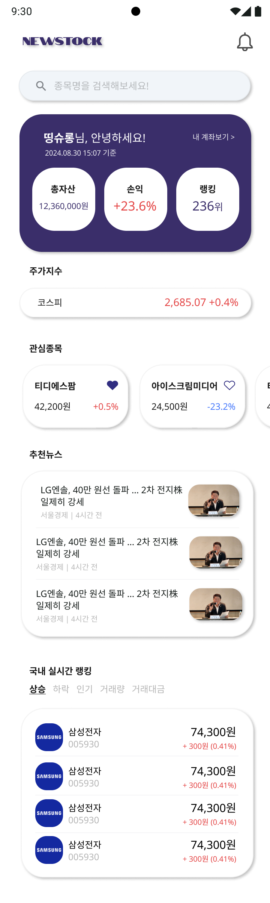
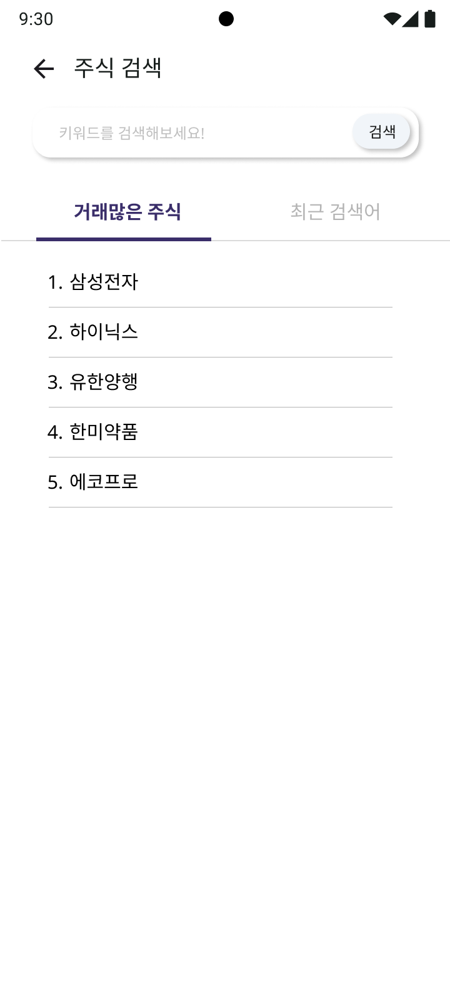
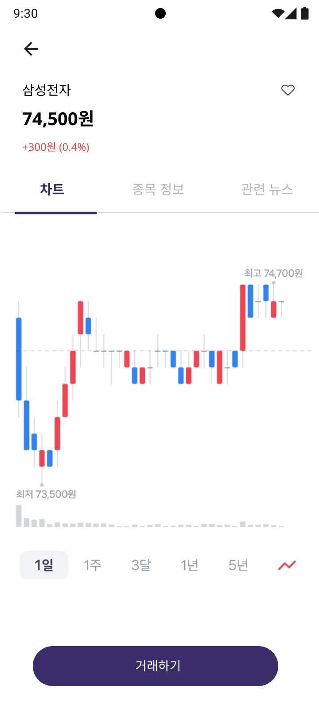
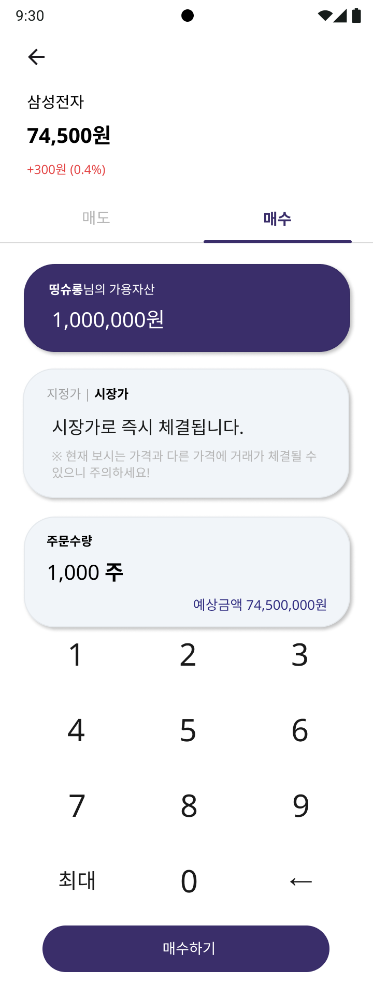
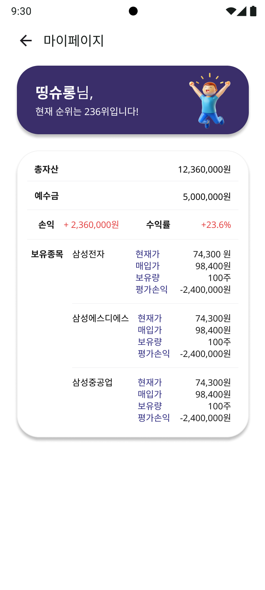
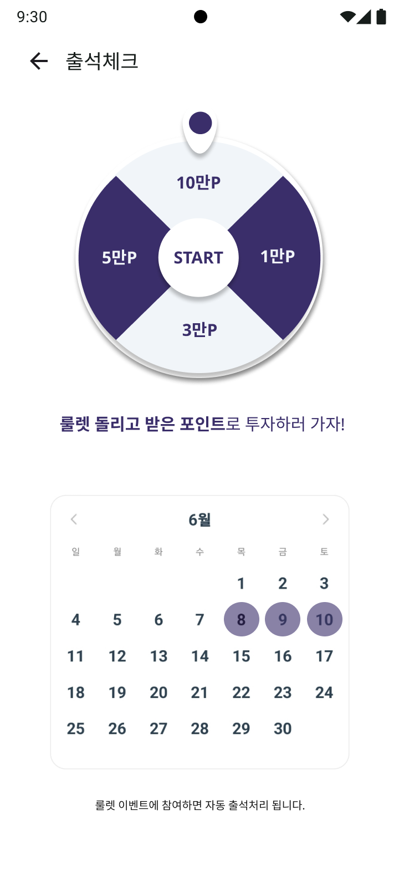
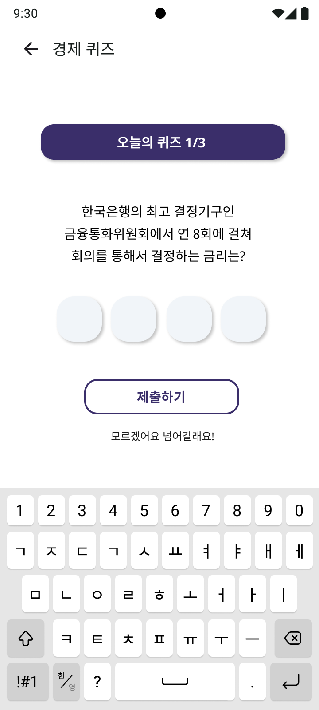

### 개발 진행사항
- 전체 페이지 UI 개발 완료
- 컴포넌트 분리 및 리팩토링 계획 및 일부 시작
- API 연결 시작
- 공통변수 추출 작업 일부 시작

## 백엔드 진행사항

### 기술스택
- JAVA
- SPRING BOOT
- JPA
- REDIS
- HADOOP
- SPARK
- SPRING BATCH

### 개발 진행사항
- 주식 지정가 매도/매수 진행중
- 스프링 배치를 이용해서 장 마감시 당일 주식 데이터 수집 완료
- 뉴스 분산/자연어 처리 진행중

## 인프라 진행사항

### 기술스택
- DOCKER
- JENKINS
- FLYWAY
- DOCKER COMPOSE
- DOCKER HUB

### 개발 진행사항
- nginx 이용해서 배포 완료
- jenkins 파이프라인 구축 완료
- docker hub를 이용하여 버전관리
- flyway를 활용하여 스키마 버전관리
