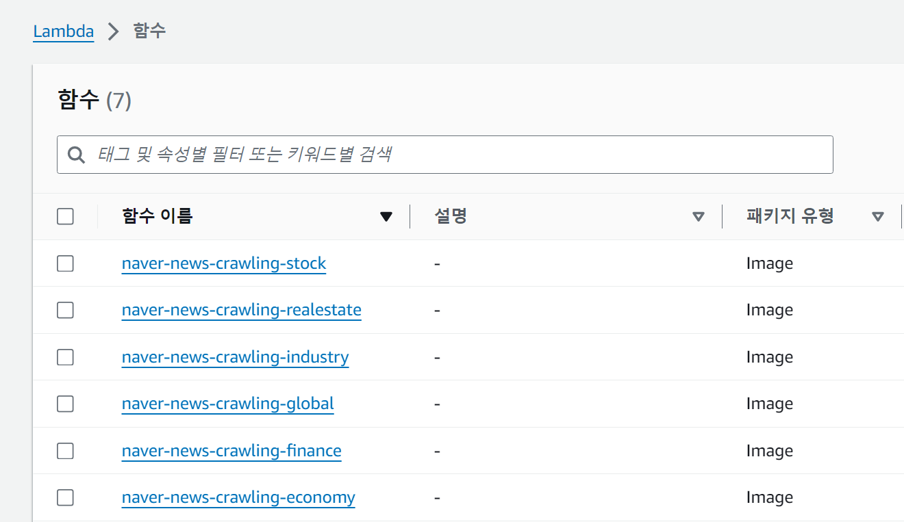

# 포팅 매뉴얼

# 1. Gitlab 소스 클론 이후 빌드 및 배포할 수 있도록 정리한 문서

### 1-1)

- **JVM**
    - JVM: OpenJDK 17
- **웹서버**
    - 웹서버: Nginx
    - 설정 파일 경로 : `/etc/nginx/conf.d/default.conf`
    - 주요 설정
        
        ```bash
        upstream blue {
                server 172.26.0.138:8082;
        }
        
        upstream green {
                server 172.26.0.138:8081;
        }
        
        server {
            listen       80;
            listen  [::]:80;
            server_name j11b306.p.ssafy.io;
        
            include /etc/nginx/conf.d/service-env.inc;
        
            location / {
                proxy_pass http://$service_url;
        
                proxy_http_version 1.1;
                proxy_set_header Connection '';
                proxy_set_header X-Real-IP $remote_addr;
                proxy_set_header X-Forwarded-For $proxy_add_x_forwarded_for;
                proxy_set_header Host $http_host;
        
                proxy_read_timeout 3600;
                proxy_send_timeout 3600;
        
                root   /usr/share/nginx/html;
                index  index.html index.htm;
            }
        
            error_page   500 502 503 504  /50x.html;
            location = /50x.html {
                root   /usr/share/nginx/html;
            }
        }
        ```
        
- **분산 서버**
    - hadoop: [https://satisfying-trouble-2d8.notion.site/2-Hadoop-1062740b8de6800786aec821ebefbb47?pvs=4](https://www.notion.so/2-Hadoop-1062740b8de6800786aec821ebefbb47?pvs=21)
    - spark: [https://satisfying-trouble-2d8.notion.site/spark-1092740b8de68000ad38d7dfcff10784?pvs=4](https://www.notion.so/spark-1092740b8de68000ad38d7dfcff10784?pvs=21)
    - python 3.8
    - 주요설정
        
        

- **WAS**
    - WAS: SpringBoot (버전 3.3.3)
    - 주요 설정
        
        ```bash
        plugins {
        	id 'java'
        	id 'org.springframework.boot' version '3.3.3'
        	id 'io.spring.dependency-management' version '1.1.6'
        }
        
        group = 'com.ssafy'
        version = '0.0.1-SNAPSHOT'
        
        java {
        	toolchain {
        		languageVersion = JavaLanguageVersion.of(17)
        	}
        }
        
        configurations {
        	compileOnly {
        		extendsFrom annotationProcessor
        	}
        }
        
        repositories {
        	mavenCentral()
        }
        
        dependencies {
        	implementation 'org.springframework.boot:spring-boot-starter-data-jpa'
        	implementation 'org.springframework.boot:spring-boot-starter-validation'
        	implementation 'org.springframework.boot:spring-boot-starter-web'
        	implementation 'org.springframework.boot:spring-boot-starter-security'
        	implementation 'io.jsonwebtoken:jjwt:0.9.1'
        	implementation 'javax.xml.bind:jaxb-api:2.3.0'
        	implementation 'org.flywaydb:flyway-core'
        	implementation "org.flywaydb:flyway-mysql"
        	implementation 'org.springframework.boot:spring-boot-starter-thymeleaf'
        	implementation 'org.springframework.boot:spring-boot-starter-mail'
        	implementation 'org.thymeleaf.extras:thymeleaf-extras-springsecurity6'
        	implementation 'org.springframework.boot:spring-boot-starter-batch'
        	testImplementation 'org.springframework.batch:spring-batch-test'
        	compileOnly 'org.projectlombok:lombok'
        	runtimeOnly 'com.h2database:h2'
        	runtimeOnly 'com.mysql:mysql-connector-j'
        	annotationProcessor 'org.projectlombok:lombok'
        	testImplementation 'org.springframework.boot:spring-boot-starter-test'
        	testImplementation 'org.springframework.security:spring-security-test'
        	runtimeOnly 'org.mariadb.jdbc:mariadb-java-client'
        	testRuntimeOnly 'org.junit.platform:junit-platform-launcher'
        
        	implementation 'org.springframework.boot:spring-boot-starter-webflux'
        	implementation 'org.springdoc:springdoc-openapi-starter-webmvc-ui:2.0.2'    //Swagger
        
        	implementation 'org.springframework.boot:spring-boot-starter-data-redis'
        	implementation 'org.apache.httpcomponents:httpclient:4.5.13'
        
        	// QueryDsl
        	implementation 'com.querydsl:querydsl-jpa:5.0.0:jakarta'
        	annotationProcessor "com.querydsl:querydsl-apt:${dependencyManagement.importedProperties['querydsl.version']}:jakarta"
        	annotationProcessor "jakarta.annotation:jakarta.annotation-api"
        	annotationProcessor "jakarta.persistence:jakarta.persistence-api"
        
        	// jsoup
        	implementation 'org.jsoup:jsoup:1.15.3'
        }
        
        // gradle clean 시에 QClass 디렉토리 삭제
        clean {
        	delete file('src/main/generated')
        }
        
        tasks.named('test') {
        	useJUnitPlatform()
        }
        ```
        

### 1-2 빌드 시 사용되는 환경 변수 등의 내용 상세 기재

| `DEV_NAME` | admin |
| --- | --- |
| `DEV_PASSWORD` | ssafyssafy |
| `GMAIL_PASSWORD` | gvuy pfql mlbd rmrl |
| `GMAIL_USERNAME` | [leejh0799@gmail.com](mailto:leejh0799@gmail.com) |
| `REFRESH_KEY` | refresh |
| `SECRET_KEY` | secret |
| `PROD` | [https://openapi.koreainvestment.com:9443](https://openapi.koreainvestment.com:9443/) |
| `PROD_APPKEY` | PSvg6rZ5MtH1a8lkiWSgMlwIjkSCKq8WTndh |
| `PROD_APPKEY` |  |
|  |  |

| `PROD_APPSECRET` | +jZsJKqggfFmjbUxJrnz3gEZHPy9lIEZQmxGXxlG6NpeWG5XJLjG9jyMlXxHSIeGun6f1Mz5/NJ3YYFewJMALAd88692VS5YtPc4phfLzR6mKVDixnB3gYQ26DsdIQyzBtHBLtcIK5tby4crZ5D0ykA0yFXs3L8ugYAlGNC/LUjG+bCZBmM= |
| --- | --- |
| `TWELVEDATA_API_KEY` | 548255292d9d4431aae3f29c7ce644f9 |
| `MARKETINDEX_API_KEY` | SWASJPbuAU0D61k97THb8ScGih4OhO/UfIZ99OBzuDh2Cg88jAvhXBY83JUPiFi1GiQxF+4K0Xa/di+El+sKdg== |
| `REDIS_PASSWORD` | newstock123 |

### 1-3 배포 시 특이사항 기재

blue, green 무중단 배포 전략 사용

### 1-4 DB 접속 정보 등 프로젝트에 활용되는 주요 계정 및 프로퍼티가 정의된 파일 목록

```bash
# application.yml

spring:
  application:
    name: newstock
  jpa:
    properties:
      hibernate:
        show_sql: true
        format_sql: true
        jdbc:
          time_zone: Asia/Seoul
  sql:
    init:
      mode: always
  mail:
    host: smtp.gmail.com
    port: 587
    username: ${GMAIL_USERNAME}
    password: ${GMAIL_PASSWORD}
    properties:
      mail:
        smtp:
          auth: true
          timeout: 5000
          starttls:
            enable: true

  profiles:
    active: local
    group:
      local: local, common, secret
      blue: blue,common, secret
      green: green, common, secret

jwt:
  secret-key: ${SECRET_KEY}
  refresh-key: ${REFRESH_KEY}

server:
  env: blue

kis:
  prod: ${PROD}
  prod-appkey: ${PROD_APPKEY}
  prod-appsecret: ${PROD_APPSECRET}

twelvedata:
  api:
    key: ${TWELVEDATA_API_KEY}

marketindex:
  api:
    key: ${MARKETINDEX_API_KEY}
```

```bash
# application-local.yml

spring:
  config:
    activate:
      on-profile: local
  datasource:
    driver-class-name: org.mariadb.jdbc.Driver
    url: jdbc:mariadb://localhost:3306/newstock?serverTimezone=Asia/Seoul&characterEncoding=UTF-8
    username: ${LOCAL_NAME}
    password: ${LOCAL_PASSWORD}
  jpa:
    hibernate:
      ddl-auto: validate
    properties:
      hibernate:
        dialect: org.hibernate.dialect.MariaDBDialect
  flyway:
    enabled: true
    baseline-on-migrate: true
    baseline-version: 1
    fail-on-missing-locations: true
  data:
    redis:
      host: localhost
      port: 6379
  batch:
    jdbc:
      initialize-schema: always

server:
  port: 8080
  address: localhost

serverName: local_server

```

```bash
# application-blue.yml

spring:
  config:
    activate:
      on-profile: blue
  datasource:
    driver-class-name: org.mariadb.jdbc.Driver
    url: jdbc:mariadb://maria-1.clwm8q0y4es7.ap-northeast-2.rds.amazonaws.com:3306/ssafy
    username: ${DEV_NAME}
    password: ${DEV_PASSWORD}
  jpa:
    hibernate:
      ddl-auto: none
    properties:
      hibernate:
        dialect: org.hibernate.dialect.MariaDBDialect

  flyway:
    enabled: false  # Flyway 비활성화

  data:
    redis:
      host: localhost
      port: 6379
      password: ${REDIS_PASSWORD}

server:
  port: 8082
  address: 0.0.0.0

serverName: blue_server
```

# 2. 프로젝트에서 사용하는 외부 서비스 정보를 정리한 문서

## 2-1) 한국투자증권 오픈 API

- 사용 목적: 주식 관련 기능 구현에 필요 (주식 정보 제공, 주식 거래 등)

## 2-2) Google Gmail SMTP

- 사용 목적: 비밀번호 재발급 요청 시 이메일 인증 필요

## 2-3) AWS lambda

### 사용목적

- 네이버 뉴스 크롤링, 텍스트 마이닝



### 환경 변수


### 필요 파일

- 도커 파일

```docker
FROM public.ecr.aws/lambda/python:3.9 AS stage

RUN yum install -y -q sudo unzip
ENV CHROMIUM_VERSION=1002910

# Install Chromium
COPY install-browser.sh /tmp/
RUN /usr/bin/bash /tmp/install-browser.sh

FROM public.ecr.aws/lambda/python:3.9 AS base

COPY chrome-deps.txt /tmp/
RUN yum install -y $(cat /tmp/chrome-deps.txt)

# Install Python dependencies for function
COPY requirements.txt /tmp/
RUN python3 -m pip install --upgrade pip -q
RUN python3 -m pip install -r /tmp/requirements.txt -q

COPY --from=stage /opt/chrome /opt/chrome
COPY --from=stage /opt/chromedriver /opt/chromedriver

# copy main.py
COPY main.py /var/task/

WORKDIR /var/task

CMD [ "main.handler" ]
```

- requirements.txt
    
    ```
    anyio==3.6.1
    async-timeout==4.0.2
    click==8.1.3
    Deprecated==1.2.13
    fastapi==0.79.0
    greenlet==1.1.3
    h11==0.13.0
    idna==3.3
    numpy==1.23.2
    packaging==21.3
    pandas==1.4.3
    pydantic==1.9.2
    pymemcache==3.5.2
    pyparsing==3.0.9
    python-dateutil==2.8.2
    pytz==2022.2.1
    redis==4.3.4
    six==1.16.0
    sniffio==1.2.0
    starlette==0.19.1
    typing-extensions
    uvicorn==0.18.3
    wrapt==1.14.1
    sqlalchemy==1.4.39
    selenium
    requests
    python-dotenv
    pytz
    ```
    

## 2-4) AWS S3

### 사용 목적

- 크롤링 데이터 저장

[https://satisfying-trouble-2d8.notion.site/master-node-s3-1092740b8de6802eb46ede6c8b59230a?pvs=4](https://www.notion.so/master-node-s3-1092740b8de6802eb46ede6c8b59230a?pvs=21)

## 2-5) AWS ECR

### 사용 목적

- 도커 이미지 저장소


- 보안 관리 (IAM)


- 다른 AWS 서비스(Lambda)와 연동

# 3. DB 덤프 파일 최신본

# 4. 시연 시나리오

1. 미리 로그인한 상태에서 애플리케이션을 키며 메인 페이지를 보여준다.
2. 주식 모의 투자 페이지에 들어간다.
3. 주식 메인 페이지를 보여주며 설명한다.(시연 계정에 뉴스가 있는 주식들을 관심 종목으로 등록해둠)
4. 주식을 검색한다. → 삼성 전자 그리고 최근, 거래량 순 보여준다
5. 삼성 전자 주식 페이지 다 보여주며 설명한다. 
6. 시장 가 매수를 하고 지정 가 매도를 한다.
7. 마이 페이지를 보여주며 거래한 주식들이 잘 들어있는지 보여준다.
8. 랭킹도 보여준다.
9. 뉴스로 이동
10. 뉴스 메인 페이지 보여준다.
11. 뉴스 검색 → 인기 검색어, 최근 검색어
12. 인기 검색어를 눌러서 검색한다. 
13. 스크랩하기 누른다. 스크랩 편집 후 저장
14. 내가 스크랩한 기사 페이지 보여주고 스크랩 편집이 반영되어있는지 보여준다.
15. 출석 체크 보여준다. 
16. 퀴즈 페이지 보여준다.
