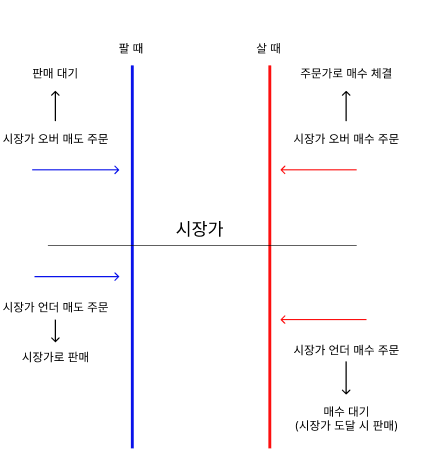
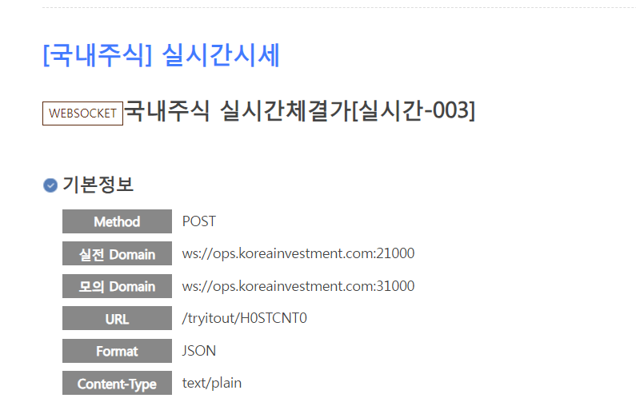

# 학습 내용

1. virtual Box & Ubuntu 설치해서 도커 이미지 파일로 컨테이너 생성
    ex) 우분투 & xShell 네트워크 설정

2. 컨테이너 관련 명령어 학습
    2-1. 컨테이너 시작, 정지, cpu 리소스 제한 등등
    ex) /bin/bash : bin에 있는 bash란 이름의 쉘
    2-2. 컨테이너 내부에 젠킨스 설치

3. 주식 관련 금융 api 조사 및 주식 상식 공부

    3-1. 

    3-2. 

4. 아이디어 기획 회의 진행
    4-1. 모의 투자 & 경제 뉴스 선정 및 구체화 작업 진행 

    - 실제 주식과 비슷한 모의 주식 투자 플랫폼
    - 실시간 주가 변동 반영
    - 가입 시 시드 머니 적립
    - 출석 체크, 퀴즈 참여 시 추가 머니 제공

    - 퀴즈 자동 생성
    - 정답 시 포인트 획득

    - 개인화 된 뉴스 기사
    - 키워드를 통한 검색
    - 카테고리 기능
    - 뉴스기사 스크랩
    - 인기 뉴스 제공
